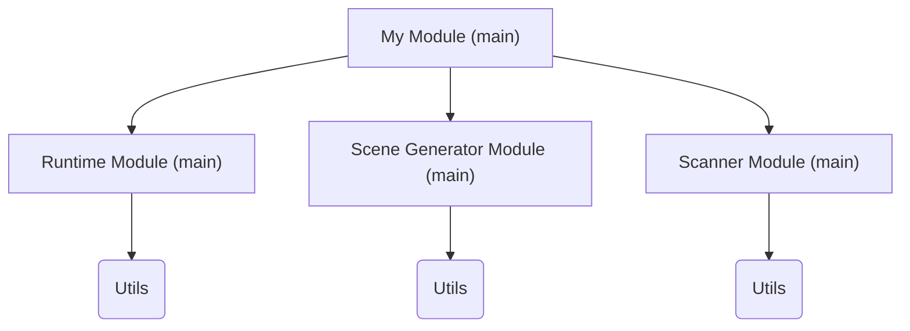

# Documentation

Table of Contents

- [Documentation](#documentation)
  - [Information](#information)
  - [Architecture](#architecture)
  - [Modules](#modules)
    - [Runtime](#runtime)
      - [Runtime Parameters](#runtime-parameters)
    - [Generating Scenes](#generating-scenes)
      - [Scene Gen Parameters](#scene-gen-parameters)
    - [Scanner Manipulation](#scanner-manipulation)
      - [Scan Parameters](#scan-parameters)
  - [Input Format](#input-format)

## Information

The required parameters will be marked with (!), and the optional with (?).

Number of all parameters: 12, among them

- 7 required parameters
- 5 optional parameters

## Architecture

- Main File
  - Runtime Module
    - utils
    - tests
  - Scene Gen Module
    - utils
    - tests
  - Scan Module
    - utils
    - tests



## Modules

### Runtime

#### Runtime Parameters

**Count:** \
1 required parameter \
2 optional parameters

- **Render Images (!)**: Whether the program should render images, parameter is set using $\texttt{true}$ or $\texttt{false}$.
- **Render Frequency (?)**: How many sceneries should Blender render images, should only be given if Render Images parameter is given. There can be two ways of giving the number:
  - a percentage, e.g., $10$ ($\%$) in a set of $1000$ would mean that 100 of scenes will have rendered images included. Default value could be $10\%$.
  - a step number, i.e., $10$ would mean *every tenth* scene will have rendered images included. Default value would be dynamic, as the size of data set might vary.
- **Number of Scan Samples (?)**: How many scans per scene, in other words: make $n$ scans with different camera positions. <mark>(Discuss with Carsten what parameters might be interesting to attach this one.)</mark>

### Generating Scenes

#### Scene Gen Parameters

Following is a list of proposed parameters for the scene generation script.

**Count:** \
4 required parameters \
2 optional parameter

- **Scene Size (!)**: How far will be the objects be generated from the camera. There are two ways to express this parameter:
  - using the distance from the camera, e.g., max. `10` of units (the restricted area will always be a sphere),
  - giving two tuples of coordinates, $\left(x_0, y_0, z_0\right)$ and $\left(x_1, y_1, z_1\right)$, that defines a box.
- **Objects to Generate (!)**: A set of objects that can be generated, e.g., $\{\texttt{sphere}, \texttt{triangle\_based\_pyramid}, \texttt{cube}\}$
  - if that's relevant, a dictionary could be given with a number related to each object, indicating how many objects are supposed to be generated.
- **Object Count Range (!)**: Number of objects to be generated from the set, there could be two possible types:
  - integer: the same number of objects is generated for all scenes,
  - tuple: on form $(\max, \min)$, for the random number generator (RNG) to vary the number of objects for each scene.
- **Object Size Range (!)**: Defines the range of size that an object can havem there could be two possible types:
  - integer: the same size for all objects,
  - tuple: on form $(\max, \min)$, defining the range of sizes for the objects.
- **Object Height Distribution (?)**: Defines the average $z$-position of an object with a varation of the given standard deviation. This will be given as a tuple of two integers $(\text{mean}, \text{std})$.
  - the default value (representation is not defined yet) won't give any height restriction,
  - example: $(5, 2)$ as argument will allow all objects to have the $z$-position in the interval $\left[5-2, 5+2\right] = \left[3, 7\right]$.
- **Allow Object Overlap (?)**: If set to $\texttt{false}$, the new object is checked for ovelap - if it overlaps, remove and generate a new one, otherwise leave it. If set to $\texttt{false}$, this check is ommited.
  - the default value is not decided yet (which one is more interesting?)
  - if an object overlaps another 100%, i.e., one gets generated in another, the new object will be removed and regenerated.
  - checking for overlap of two objects by their meshes is a complex task. The most optimal solution will be comparing their Axis-Aligned Bounding Box (AABB), i.e., bounding box is the smallest box, aligned with the coordinate axes, that completely encloses the object.

### Scanner Manipulation

#### Scan Parameters

Following is a list of proposed parameters for the camera script.

**Count:** \
2 required parameters \
1 optional parameter

- **Scanning Angle Range (!)**: How much should the camera rotate in its vertical axis.
- **Height Density (!)**: <mark>(should be renamed)</mark> How slow should the camera rotate. The slower rotation, the more samples will be measured (a more dense point cloud will appear).
- **Number of Rotations (?)**: <mark>(discuss with Carsten: I think it wasn't necessary)</mark> How many times should the camera rotate in its angle range.
  - example: $2$ could mean either two "down-and-up" rotations, or just one down, then one up.

## Input Format

Will most likely be JSON, but XML can be also considered to be implemented at the same time.

```JSON
{
    "runtime_params": {

    },
    "scene_params": {
        "scene_size": 10,
        "objects_to_generate": [
            "box",
            "sphere",
            "cylinder",
            "triangular_pyramid",
            "rectangular_pyramid",
            "cone"
        ],
        "object_count_range": [3, 9],
        "object_size_range": [10, 100],
        "object_height_distribution": [65.0, 32.0],  // optional parameter
        "allow_object_overlap": true                 // optional parameter
    },
    "scanner_params": {

    }
}
```
